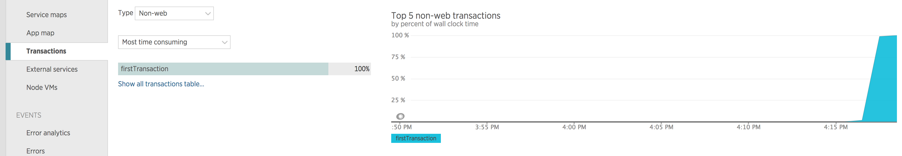
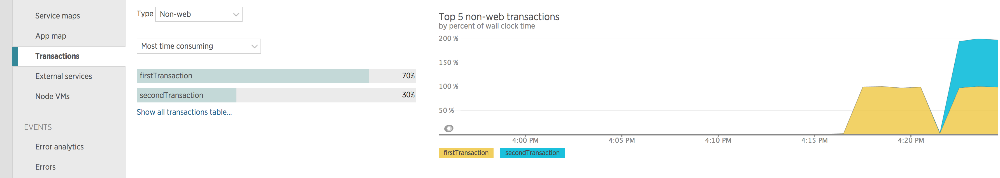

### Introduction

This tutorial goes over an example instrumentation of a library that loses
transaction state, and some of the difficulties associated with doing so.  The
sample instrumentation will be [`generic-pool`][1].

Here is the full code for this instrumentation, which will be broken down in
more detail below:

```js
module.exports = function initialize(agent, generic, moduleName, shim) {
  var proto = generic && generic.Pool && generic.Pool.prototype

  function wrapPool(pool)
    shim.wrap(pool, 'acquire', function wrapAcquire(shim, original, name, callback) {
      return function wrappedAcquire(callback, priority) {
        return original.call(this, shim.bindSegment(callback), priority)
      }
    })
  }

  if (proto && proto.acquire) {
    wrapPool(proto)
  } else {
    shim.wrapReturn(generic, 'Pool', function wrapPooler(shim, original, name, pooler) {
      wrapPool(pooler)
    })
  }
}
```


### Motivation

We would like to time the execution of all code that was caused by a certain
event.  This package of associated timings is called a transaction, and an http
request is the typical event that caused it.  This can be difficult since Node
executes javascript in an asynchronous fashion, leading to potentially disparate
call stacks.

When javascript is executed by Node, more code can be queued in libuv or v8 to
execute asynchronously through functions like `setTimeout`.  These asynchronous
functions will delay execution of their callbacks until some point in the
future, and upon execution there will be no context data stored about the origin
of the callback.  These asynchronous boundaries pose an issue when trying to
associate where a particular piece of code was queued.

As of writing this, there are no general solutions to carrying state over these
asynchronous boundaries.  Domains were an attempt at this, but have since been
deprecated.  This is one of the important roles of instrumentation.  Even if
generating timing information for a certain module isn't desired, it may be
necessary to create instrumentation for it to maintain transaction state over an
asynchronous boundary introduced in the module.

There are two major symptoms of uninstrumented asynchronous methods: complete
transaction state loss and confounded transactions.  Completely losing
transaction state typically manifests in lost data and is most commonly caused
by calls into asynchronous native code that the agent is unaware of.  Conflated
transactions can lead to one transaction's data ending up on another,
effectively making the data untrustworthy and useless.

The way we treat both situations is the same: when the asynchronous function is
invoked, wrap the callback in a closure that will restore context before
executing the original reentry code.

### Generic Pool Breakdown

The `generic-pool` module exports a [constructor][2] it uses for its job
pooling.  In order to follow execution in the pool, we need to use {@link
Shim#bindSegment} on the [`acquire`][3] method.  As of v2 of the library this
method is placed on the prototype of the constructor, wrapping this as so will
suffice:

```js
module.exports = function initialize(agent, generic, moduleName, shim) {
  var proto = generic && generic.Pool && generic.Pool.prototype

  function wrapPool(pool)
    shim.wrap(pool, 'acquire', function wrapAcquire(shim, original, name, callback) {
      return function wrappedAcquire(callback, priority) {
        return original.call(this, shim.bindSegment(callback), priority)
      }
    })
  }


  wrapPool(proto)
}
```

However, in v1 of the module, there is no prototype on this constructor, and we
must wrap [`acquire`][4] on the constructed object using {@link Shim#wrapReturn}
as so:

```js
module.exports = function initialize(agent, generic, moduleName, shim) {
  function wrapPool(pool)
    shim.wrap(pool, 'acquire', function wrapAcquire(shim, original, name, callback) {
      return function wrappedAcquire(callback, priority) {
        return original.call(this, shim.bindSegment(callback), priority)
      }
    })
  }

  shim.wrapReturn(generic, 'Pool', function wrapPooler(shim, original, name, pooler) {
    wrapPool(pooler)
  })
}
```

In order to handle both cases, we will check for `acquire` on the prototype and
wrap on that before defaulting to wrapping the return value of the constructor:

```js
module.exports = function initialize(agent, generic, moduleName, shim) {
  var proto = generic && generic.Pool && generic.Pool.prototype

  function wrapPool(pool)
    shim.wrap(pool, 'acquire', function wrapAcquire(shim, original, name, callback) {
      return function wrappedAcquire(callback, priority) {
        return original.call(this, shim.bindSegment(callback), priority)
      }
    })
  }

  if (proto && proto.acquire) {
    wrapPool(proto)
  } else {
    shim.wrapReturn(generic, 'Pool', function wrapPooler(shim, original, name, pooler) {
      wrapPool(pooler)
    })
  }
}
```

Note we don't write instrumentation for v3 of the library, since it is promise
based and state should be preserved by our promise instrumentation.

### Toy example

In order to fully illustrate the process let's instrument a homemade work
queuing system. Consider the following code which queues functions and executes
them in batches every second:

```js
'use strict'

function Queue() {
  this.jobs = []
}

function run(jobs) {
  while (jobs.length) {
    jobs.pop()()
  }
}

Queue.prototype.scheduleJob = function scheduleJob(job) {
  var queue = this
  process.nextTick(function() {
    if (queue.jobs.length === 0) {
      setTimeout(run, 1000, queue.jobs)
    }
    queue.jobs.push(job)
  })
}

module.exports = Queue
```

With example code that uses it:

```js
var Queue = require('jobQueue')
var queue = new Queue()

queue.scheduleJob(function() {
  console.log('this prints first')
})

var i = 0
queue.scheduleJob(function counter() {
  console.log(i++)
  queue.scheduleJob(counter)
})
```

In order to properly instrument this system, we'd like to call {@link
Shim#bindSegment} on the job functions on their way into the system.  To prove
that the instrumentation is broken, let's modify the example to illustrate the
undesired behavior.

```js
var nr = require('newrelic')

var Queue = require('jobQueue')
var queue = new Queue()

nr.startBackgroundTransaction('firstTransaction', function first() {
  var transaction = nr.getTransaction()
  queue.scheduleJob(function firstJob() {
    // Do some work
    transaction.end()
  })
})

nr.startBackgroundTransaction('secondTransaction', function second() {
  var transaction = nr.getTransaction()
  queue.scheduleJob(function secondJob() {
    // Do some work

    // Transaction state will be lost here because 'firstTransaction' will have
    // already ended the transaction
    transaction.end()
  })
})
```

Without instrumentation executing this code will cause `'firstTransaction'` to
be the active transaction in both `firstJob` and `secondJob`.  This confounding
of transactions is due to the `scheduleJob` method using `setTimeout` to queue
the running of jobs.  When the callback to `setTimeout` is called the
transaction that was active when `setTimeout` was invoked will be restored.
Since `'firstTransaction'` is active when `setTimeout` is called, this is restored
and `firstJob` is invoked, ending the transaction.  When the queue gets around
to executing `secondJob` the `'firstTransaction'` has already been ended, and
the current executing transaction will be `null`.  If `firstJob` didn't end the
transaction, the work done in `secondJob` would be incorrectly associated with
`'firstTransaction'`.  Now that we have a test case we can start writing our
instrumentation for the work queue.  This behavior can be seen in the UI:

[][5]

The instrumentation will be relatively simple, we just need to call {@link
Shim#bindSegment} on the jobs as they are passed in.  The purpose of this
instrumentation is to wrap the job in a function that will restore transaction
context for the duration of the job's execution.  Note this instrumentation will
not handle timing the queue or the work executed by it, in order to do that we
would use {@link Shim#record}.  Enough with the prose, here is the
instrumentation in its entirety:

```js
var nr = require('newrelic')
nr.instrument(
  'jobQueue',
  function onRequire(shim, jobQueue) {
    shim.wrap(
      jobQueue.prototype,
      'scheduleJob',
      function wrapJob(shim, original){
        return function wrappedScheduleJob(job) {
          return original.call(this, shim.bindSegment(job))
        }
      }
    )
  }
)
```

After executing the above code before calling `require('jobQueue')` we can tell
the agent to instrument the module on require as so:

```js
var nr = require('newrelic')

nr.instrument(
  'jobQueue',
  function onRequire(shim, jobQueue) {
    shim.wrap(
      jobQueue.prototype,
      'scheduleJob',
      function wrapJob(shim, original){
        return function wrappedScheduleJob(job) {
          return original.call(this, shim.bindSegment(job))
        }
      }
    )
  }
)

var Queue = require('jobQueue')
var queue = new Queue()

nr.startBackgroundTransaction('firstTransaction', function first() {
  var transaction = nr.getTransaction()
  queue.scheduleJob(function firstJob() {
    // Do some work
    transaction.end()
  })
})

nr.startBackgroundTransaction('secondTransaction', function second() {
  var transaction = nr.getTransaction()
  queue.scheduleJob(function secondJob() {
    // Do some work

    // Transaction state will be lost here because 'firstTransaction' will have
    // already ended the transaction
    transaction.end()
  })
})
```

The correct instrumentation should be noticeable in the UI as now both
transactions appear, and the timer used by the work queue appears as a segment
in `'firstTransaction'`

[][5]


### Questions?

We have an extensive [help site](https://support.newrelic.com/) as well as
[documentation](https://docs.newrelic.com/). If you can't find your answers
there, please drop us a line on the [community forum](https://discuss.newrelic.com/).

[1]: https://www.npmjs.com/package/generic-pool
[2]: https://github.com/coopernurse/node-pool/blob/v2.5.4/lib/generic-pool.js#L630
[3]: https://github.com/coopernurse/node-pool/blob/v2.5.4/lib/generic-pool.js#L428
[4]: https://github.com/coopernurse/node-pool/blob/v1.0.12/lib/generic-pool.js#L262
[5]: https://docs.newrelic.com/docs/apm/applications-menu/monitoring/transactions-page
