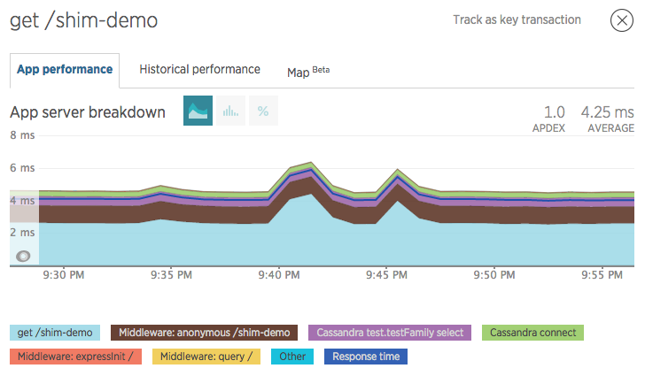
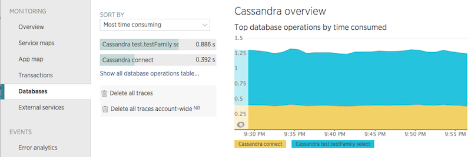

### Pre-requisite

{@tutorial Instrumentation-Basics}

### Introduction

This tutorial goes over a simple datastore instrumentation. This is directly
pulled from our actual [`cassandra-driver`][1] instrumentation. It is meant to
be an introduction to instrumentation.

Here is the full code for this instrumentation, don't worry if it doesn't make
sense at first glance, we'll break it down line by line below.

```js
function instrumentCassandra(shim, cassandra, moduleName) {
  shim.setDatastore(shim.CASSANDRA)

  var proto = cassandra.Client.prototype
  shim.recordOperation(proto, ['connect', 'shutdown'], {callback: shim.LAST})
  shim.recordQuery(proto, '_execute', {query: shim.FIRST, callback: shim.LAST})
  shim.recordBatchQuery(proto, 'batch', {
    query: findBatchQueryArg,
    callback: shim.LAST
  })
}

function findBatchQueryArg(shim, batch, fnName, args) {
  var sql = (args[0] && args[0][0]) || ''
  return sql.query || sql
}
```

### What to Record

For a datastore, there are just two types of things to record: operations and
queries. Not all datastores have both actions, for example with Redis you do not
write queries, only operations (or commands in their terminology).

**Operation**

Operations are any actions that do not send a query to be executed by the
datastore server. Examples for classic RDBs include connecting to the database,
closing the connection, or setting configurations on the server. Often these are
actions that modify the connection or datastore, but not the data. Operations
are recoded using the [`DatastoreShim`]{@link DatastoreShim} method
[`recordOperation`]{@link DatastoreShim#recordOperation}.

**Queries**

Queries are any action that manipulate or fetch data using a specialized query
language. For a SQL database, this is any action that sends SQL code to the
server for execution. These are recorded using the method
[`recordQuery`]{@link DatastoreShim#recordQuery}. In some cases, the datastore
in use may support sending multiple queries in a single request. These are
considered "batch queries" and are recorded using
[`recordBatchQuery`]{@link DatastoreShim#recordBatchQuery}.

Once we're done, we can view the results on the transaction breakdown page. For
example, this simple Express route handler would generate a graph like the one
below.

```js
server.get('/shim-demo', function(req, res, next) {
  client.execute('SELECT * FROM test.testFamily WHERE pk_column = 111', function() {
      res.send('foo')
  })
})
```

<div style="text-align:center">
  [][4]
</div>


--------------------------------------------------------------------------------


### The Instrumentation Function

```js
function instrumentCassandra(shim, cassandra, moduleName) {
  // ...
}
```

This is the function that we'll hand to the New Relic agent to perform our
instrumentation. It receives a {@link DatastoreShim}, the module to instrument
([`cassandra-driver`][1] in our case), and the name of the package (e.g.
`"cassandra-driver"`). Inside this function we'll perform all of our logic to
record operations and queries for Cassandra.


### Specifying the Datastore

```js
  shim.setDatastore(shim.CASSANDRA)
```

Here we simply tell the shim the name of our datastore. In our case we're using
one of the [predefined datastore names]{@link DatastoreShim.DATASTORE_NAMES},
but we could have also passed in a string like `"Cassandra"` instead. This name
will show up on the [New Relic APM Databases page][2] like this:

<div style="text-align:center">
  [][2]
</div>


### Recording Operations

```js
  var proto = cassandra.Client.prototype
  shim.recordOperation(proto, ['connect', 'shutdown'], {callback: shim.LAST})
```

Now on to the actual instrumentation. In `cassandra-driver`, all of the
interaction with the database happens through this [`cassandra.Client`][3] class,
so we grab it's prototype to inject our code into.

After grabbing the prototype, we tell the shim which methods we want to record
using [`shim.recordOperation`]{@link DatastoreShim#recordOperation}. In our
case, the interesting operations are `connect` and `shutdown`. Since these
methods are nicely named, we can pass them both at once and let the shim use
them to name our metrics. We can see the results of this on APM in the
transaction breakdown graph. The green layer labeled `Cassandra connect` is from
our recorded operation.

<div style="text-align:center">
  [][4]
</div>

The third parameter is the ["spec" for this operation]{@link OperationSpec}.
Specs are simply objects that describe the interface for a function. For
operations, we just want to know when it has ended, which is indicated by the
callback being called, so we tell the shim which argument is the callback. We
can provide any numerical index for the callback argument, and the shim provides
[some predefined constants]{@link Shim#ARG_INDEXES}. `shim.LAST` indicates the
last argument passed in, we could have also provided `-1` as the index, but the
named constants are more readable.

If we didn't like the names of the methods, we could supply an alternate name to
`shim.recordOperation` in the last parameter like this:

```js
  shim.recordOperation(proto, 'connect', {name: 'Connect', callback: shim.LAST})
  shim.recordOperation(proto, 'shutdown', {name: 'Shutdown', callback: shim.LAST})
```

Note that since we want these operations named differently, if we specify the
name we must call `shim.recordOperation` for each operation.

If the callback argument can't be easily identified by a positive or negative
offset in the arguments array, then a {@link CallbackBindFunction} could be
supplied instead. This function will receive the arguments and the segment, and
is responsible for connecting the two. Here's how that might look in our case:

```js
  shim.recordOperation(proto, ['connect', 'shutdown'], {
    callback: function operationCallbackBinder(shim, opFunc, opName, segment, args) {
      var cb = args[args.length - 1]
      args[args.length - 1] = shim.bindSegment(cb, segment, true)
    }
  })
```

Note that the `args` parameter is a proper [`Array`][5], so you can assign back
into it and use any other array manipulation that you want.


### Recording Queries

```js
  shim.recordQuery(proto, '_execute', {query: shim.FIRST, callback: shim.LAST})
```

The `cassandra.Client` class has three different methods for performing queries:
[`Client#eachRow`][6], [`Client#execute`][7], and [`Client#stream`][8]. We could
wrap all three of these methods, but with a little reading of the
[`cassandra-driver` source][9] we see that they call an internal function that
we can wrap instead.

Now that we know where to wrap, we call
[`shim.recordQuery`]{@link DatastoreShim#recordQuery} and provide it the method
name and our {@link QuerySpec}. In addition to the callback, the `QuerySpec`
requires we identify query argument. So we tell the shim that our first argument
is the query and our last is the callback.

Since Cassandra uses a SQL-like language, we can use the `DatastoreShim`'s
default query parser to pull the information it needs out of the query. So this
is all we need to do to record queries.

In the transaction breakdown graph above, the recorded query is the purple layer
labeled `Cassandra test.testFamily select`. Because our instrumentation provided
the query to the shim we can see some basic information about it, in this case
the collection queried (`test.testFamily`) as well as the query operation
(`select`).


### Recording Batch Queries

```js
  shim.recordBatchQuery(proto, 'batch', {
    query: findBatchQueryArg,
    callback: shim.LAST
  })
```

Recording batches of queries is just like recording a single one, except we need
to do a little more work to pull out the query text. In this vein we call
[`shim.recordBatchQuery`]{@link DatastoreShim#recordBatchQuery} just like we did
for `shim.recordQuery`. This time we pass in a function for the spec's `query`
parameter, `findBatchQueryArg`, which just looks like this:

```js
function findBatchQueryArg(shim, batch, fnName, args) {
  var sql = (args[0] && args[0][0]) || ''
  return sql.query || sql
}
```

The function is a {@link QueryFunction} callback, which takes in the current
shim, the function we're getting the query from, that function's name, and an
`Array` of arguments. For [`Client#batch`][10], the first argument is either an
array of strings or an array of objects that contain query strings. We want to
be very defensive when writing instrumentation, so we will default the query to
an empty string if no query was extractable.


--------------------------------------------------------------------------------


### Connecting it to the New Relic Agent

Now that we've instrumented the module, we need to tell the New Relic agent to
use it when the `cassandra-driver` package is required. This is done using the
{@link API#instrumentDatastore} method as below.

```js
var newrelic = require('newrelic')
newrelic.instrumentDatastore('cassandra-driver', instrumentCassandra)
```

This method tells the agent to call our instrumentation function when the module
is loaded by Node. It is critically important that we register our
instrumentation _before_ the module is loaded anywhere. Because we are using the
`instrumentDatastore` method, the agent will instantiate a {@link DatastoreShim}
when calling our instrumentation function. If we had used {@link API#instrument}
instead, we would get only the base class, {@link Shim}.

The `instrumentDatastore` call could have also been written using named
parameters like this:

```js
newrelic.instrumentDatastore({
  moduleName: 'cassandra-driver',
  onRequire: instrumentCassandra
})
```

This call is equivalent to the first one, it just depends on your preferred
style.


### Handling Errors

While debugging your instrumentation it can be useful to get a handle on any
errors happening within it. Normally, the agent swallows errors and disables the
instrumentation. In order to get the error for your debugging purposes you can
provide a third argument to `instrumentDatastore` that receives the error.

```js
newrelic.instrumentDatastore({
  moduleName: 'cassandra-driver',
  onRequire: instrumentCassandra,
  onError: function myErrorHandler(err) {
    // Uh oh! Our instrumentation failed, lets see why:
    console.error(err.message, err.stack)

    // Let's kill the application when debugging so we don't miss it.
    process.exit(-1)
  }
})
```


### Conclusion

We have now instrumented the package and told the New Relic agent to use our
instrumentation, but how should we get it out there? Our instrumentation can
be published to NPM if we are confident in its usefulness to others.


### Questions?

We have an extensive [help site](https://support.newrelic.com/) as well as
[documentation](https://docs.newrelic.com/). If you can't find your answers
there, please drop us a line on the [community forum](https://discuss.newrelic.com/).

[1]: https://www.npmjs.com/package/cassandra-driver
[2]: https://docs.newrelic.com/docs/apm/applications-menu/monitoring/databases-slow-queries-page
[3]: http://docs.datastax.com/en/latest-nodejs-driver-api/Client.html
[4]: https://docs.newrelic.com/docs/apm/applications-menu/monitoring/transactions-page
[5]: https://developer.mozilla.org/en-US/docs/Web/JavaScript/Reference/Global_Objects/Array
[6]: http://docs.datastax.com/en/latest-nodejs-driver-api/Client.html#eachRow
[7]: http://docs.datastax.com/en/latest-nodejs-driver-api/Client.html#execute
[8]: http://docs.datastax.com/en/latest-nodejs-driver-api/Client.html#stream
[9]: https://github.com/datastax/nodejs-driver/blob/master/lib/client.js#L589
[10]: http://docs.datastax.com/en/latest-nodejs-driver-api/Client.html#batch
