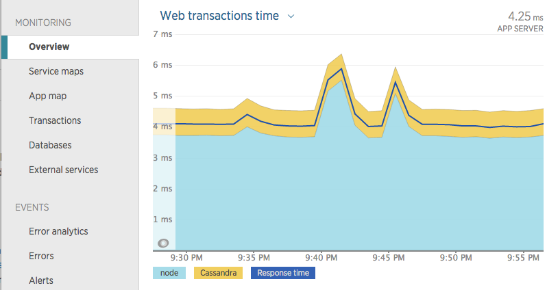

### Purpose of Instrumentation

Instrumentation for Node.js holds two purposes. The first is to give users
detailed information about what happens on their server. The more things
instrumented, the more detailed this graph can be.

[]

The second purpose is to maintain the transaction context. In order to properly
associate chunks of work with the correct transactions we must link the context
through asynchronous boundaries. This is a broad topic that is discussed in more details
in this separate tutorial {@tutorial Context-Preservation}.

### Adding Custom Instrumentation to the New Relic Agent

Calling `require('newrelic')` will return an API object, which contains the following
methods for registering custom instrumentation:

* instrument
* instrumentDatastore
* instrumentWebframework
* instrumentMessages

These methods are used to tell the New Relic agent to use the provided instrumentation
function when the specified module is loaded by Node. It is critically important that we
register our instrumentation _before_ the module is loaded anywhere.  For example:

```js
var newrelic = require('newrelic')
newrelic.instrument('my-module', instrumentMyModule)
var myModule = require('my-module')
```

All four methods have the same signature. The difference between them is in what type
of shim they provide when the instrumentation function is called. The `instrument`
method provides only the base shim {@link Shim}, while `instrumentDatastore`, `instrumentWebframework`, and `instrumentMessages` provide shims specific to the type of instrumentation
({@link DatastoreShim}, {@link WebFrameworkShim}, and {@link MessageShim} respectively).

The `instrument` call could have also been written using named
parameters like this:

```js
newrelic.instrument({
  moduleName: 'my-module',
  onRequire: instrumentMyModule
})
```

This call is equivalent to the first one, it just depends on your preferred
style.

### Handling Errors

While debugging your instrumentation it can be useful to get a handle on any
errors happening within it. Normally, the agent swallows errors and disables the
instrumentation. In order to get the error for your debugging purposes you can
provide a third argument to `instrument` that receives the error.

```js
newrelic.instrument({
  moduleName: 'my-module',
  onRequire: instrumentMyCustomModule,
  onError: function myErrorHandler(err) {
    // Uh oh! Our instrumentation failed, lets see why:
    console.error(err.message, err.stack)

    // Let's kill the application when debugging so we don't miss it.
    process.exit(-1)
  }
})
```

### Questions?

We have an extensive [help site](https://support.newrelic.com/) as well as
[documentation](https://docs.newrelic.com/). If you can't find your answers
there, please drop us a line on the [community forum](https://discuss.newrelic.com/).
