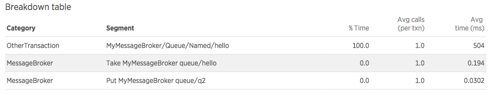
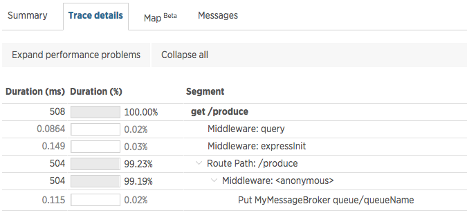
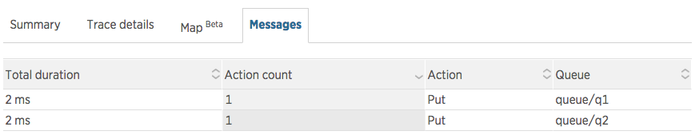
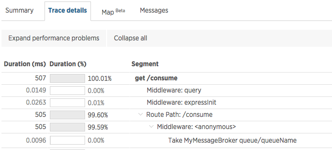
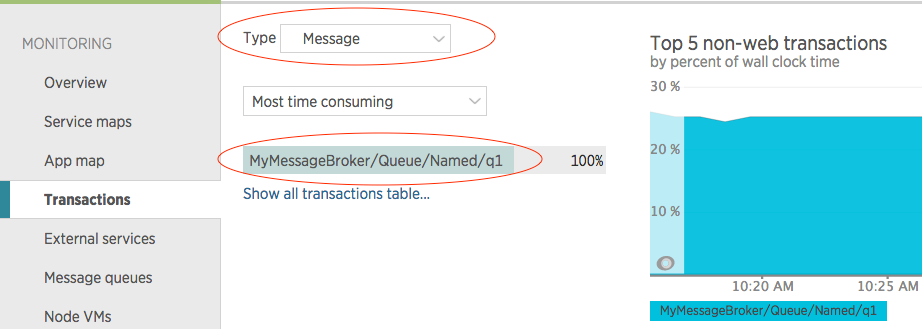

### Pre-requisite

{@tutorial Instrumentation-Basics}

### Introduction

This tutorial covers basic concepts of the Messaging instrumentation API.

Modules that interact with message brokers will typically provide:

* a function to publish a message
* a function to get a single message
* a function to subscribe to receive messages

Publishing a message typically occurs as a part of an existing transaction. For example, an Express server receives an HTTP request, publishes a message to a message broker, and responds to the HTTP request. In this case, the interesting information to capture would be how long the publish operation took as well as any identifying information about the publish operation, such as the name of the queue we were publishing to.

```js
var client = createMessageBrokerClient()

// express server
var app = express()

app.get('/', function(req, res) {
  client.publish('queueName', 'some message', function(err) {
    res.end()
  })
})
```

Consuming messages can take two forms: Either the client pulls a message from a queue, or it subscribes to receive messages as they become available (pub/sub pattern).

Pulling a message from the queue is a one-off operation, which would typically be part of an existing transaction. Similar to the publish example above, we want to know how long it took to get the message from the broker.

```js
var client = createMessageBrokerClient()

// express server
var app = express()

app.get('/', function(req, res) {
  client.getMessage('queueName', function(err, msg) {
    // Do something with the message...

    res.end()
  })
})
```

With the pub/sub pattern, the application is continuously listening to incoming messages, and therefore receiving a message does not necessarily occur inside an existing transaction. Instead, it is comparable to receiving an HTTP request, and can be thought of as a start of a new transaction.

Here is an example of a client subscribing to receive messages:

```js
var client = createMessageBrokerClient()

client.subscribe('queueName', function consumeMessage(message) {
  // get current transaction, in order to later signal that it should be ended
  var transaction = newrelic.getTransaction()

  // do something with the message and when done, end the transaction
  processMessage(message, function(err) {
    transaction.end()
  })
})
```

Every time `consumeMessage` is called, we want to record the work to process a message as a new transaction.

### The Instrumentation Function

Now that we have established what to instrument, let's start writing our instrumentation. First, we need to create a function that will contain our instrumentation:

```js
function instrumentMyMessageBroker(shim, messageBrokerModule, moduleName) {
}
```

The instrumentation function receives the following arguments:

* [shim]{@link MessageShim}

  The API object that contains methods for performing instrumentation.

* messageBrokerModule

  The loaded module that should be instrumented.

* moduleName

  The name of the loaded module. This is useful if the same instrumentation function was used to instrument multiple modules.

The function can be included in the application code itself, or it can live in a separate instrumentation module. In either case, we need to register it in our application code in order for the agent to use it. This is done in our application by calling {@link API#instrumentMessages}:

```js
var newrelic = require('newrelic')
newrelic.instrumentMessages('myMessageBroker', instrumentMyMessageBroker)
```

As a result, the agent will call our instrumentation function when the message broker module is required in the user's application code. For more details, see {@tutorial Instrumentation-Basics}.

### Specifying the Message Broker

Now that we have bootstrapped our instrumentation function, we can proceed with its implementation.

The first thing the instrumentation should specify is the name of the message broker that the library being instrumented applies to. The value is used as a part of the metric names.

```js
  shim.setLibrary(shim.RABBITMQ)
```

[]

### Producing Messages

An application can publish a message to the broker. When this happens as part of a transaction, the agent can record this call to the broker as a separate segment in the transaction trace. Here is an example of instrumenting a `publish` method on the `Client` class from the message broker module we are instrumenting.

```js
function instrumentMyMessageBroker(shim, messageBrokerModule, moduleName) {
  var Client = myMessageBrokerModule.Client

  shim.recordProduce(Client.prototype, 'publish', function(shim, fn, name, args) {
    var queueName = args[0]

    // The message headers must be pulled to enable cross-application tracing.
    var options = args[1]
    var headers = options.headers

    // misc key/value parameters can be recorded as a part of the trace segment
    var params = {}

    return {
      callback: shim.LAST,
      destinationName: queueName,
      destinationType: shim.QUEUE,
      headers: headers,
      parameters: params
    }
  })
}
```

The `recordProduce` method wraps the `publish` function, so that when it's called we can extract information about the specific call from its arguments. This is done in the callback function (third argument), where we need to return a map of parameters that describe the current operation.

* destinationType, destinationName

  Used to name the trace segment and metric

* headers (optional)

  Used to transport information needed for cross-application traces. For more information about cross-application tracing, see the section at the bottom of this tutorial.

* parameters (optional)

  Used to record additional information on the trace segment

The call would be displayed in the transaction trace as:

[]

The transaction trace window also has the Messages tab, which shows all of the messages produced or consumed during the transaction:

[]

The agent will also record a metric that can be be queried in Insights. The format of the metric is:  `MessageBroker/[libraryName]/Queue/Produce/Named/[queueName]`.

### Consuming Messages

An application can consume messages from the broker's queues. The mechanism for consuming messages can vary based on the broker and type of queues. Messages can either be consumed by the client explicitly asking for a message (e.g. a worker-queue pattern), or it can subscribe to a queue and receive messages as they become available (e.g. a pub/sub pattern).

#### Pull pattern

Let's assume that the client has a method `getMessage`. When the client calls
this, the message broker returns a message from the requested queue. The
instrumentation of this method would look like this:

```js
function instrumentMyMessageBroker(shim, messageBrokerModule, moduleName) {
  var Client = myMessageBrokerModule.Client

  shim.recordConsume(Client.prototype, 'getMessage', {
    destinationName: shim.FIRST,
    callback: shim.LAST,
    messageHandler: function(shim, fn, name, args) {
      var message = args[1]

      // These headers are used to set up cross-application tracing.
      var headers = message.properties.headers

      // misc key/value parameters can be recorded as a part of the trace segment
      var params = {
        routing_key: message.properties.routingKey
      }

      return {
        parameters: params,
        headers: headers
      }
    }
  })
}
```

Similarly to the produce-messages case, `recordConsume` wraps the function used to call the message broker. The main difference here is that some parameters may be included as arguments to the `getMessage` call, while some might be extracted from the received message. As a result, there is an extra parameter called `messageHandler`, which refers to a function to be called when a message is received. In this function we can extract additional information from the message and pass on to the API.

The call would be displayed in the transaction trace as:

[]

The agent will also record a metric that can be be queried in Insights. The format of the metric is `MessageBroker/[libraryName]/Queue/Produce/Named/[queueName]`.

#### Pub/sub pattern

For listening to messages sent by the broker, let's assume that the client has
a `subscribe` method, which registers a function for processing messages when
they are received. The instrumentation in this case would look like this:

```js
function instrumentMyMessageBroker(shim, messageBrokerModule, moduleName) {
  var Client = myMessageBrokerModule.Client

  shim.recordSubcribedConsume(Client.prototype, 'subscribe', {
    consumer: shim.LAST,
    messageHandler: function(shim, consumer, name, args) {
      var message = args[0]

      // These headers are used to set up cross-application tracing.
      var headers = message.properties.headers

      return {
        destinationName: message.properties.queueName,
        destinationType: shim.QUEUE,
        headers: headers
      }
    }
  })
}
```

The `recordSubscribedConsume` method has almost the same interface as `recordConsume`. The one difference is that we need to also specify which argument represents the consumer function (the function that will be called everytime a message arrives). This is specified using the `consumer` parameter.

The `messageHandler` parameter works the same as in the `recordConsume` case. When a message is consumed, the `messageHandler` function will be called, and we can extract the information we need from the message.

Each message processing will be shown as a separate transaction:

[]

### Cross application traces

The messaging API has support for cross application tracing, when messages are used to communicate between two different (instrumented) apps. See [Introduction to cross application traces][1] for more information about how this works in general.

Cross-application tracing relies on sending metadata along with the request and response messages. In the case of HTTP transactions, this data is transported as HTTP headers. In the case of message brokers, there is no standard way of sending headers. In order to tell the agent where this data should be attached, the API provides the `headers` parameter for both produce and consume operations. The value of this needs to be an object/map that the message broker library sends along with the message. The agent will automatically attach the needed data to this object.

### Questions?

We have an extensive [help site](https://support.newrelic.com/) as well as
[documentation](https://docs.newrelic.com/). If you can't find your answers
there, please drop us a line on the [community forum](https://discuss.newrelic.com/).

[1]: https://docs.newrelic.com/docs/apm/transactions/cross-application-traces/introduction-cross-application-traces
