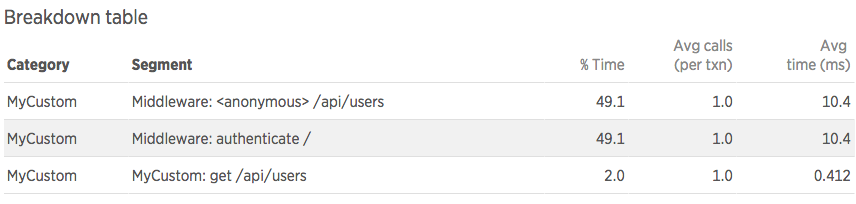
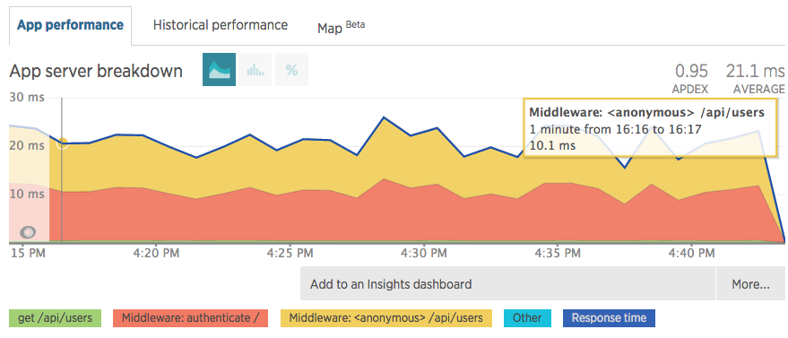
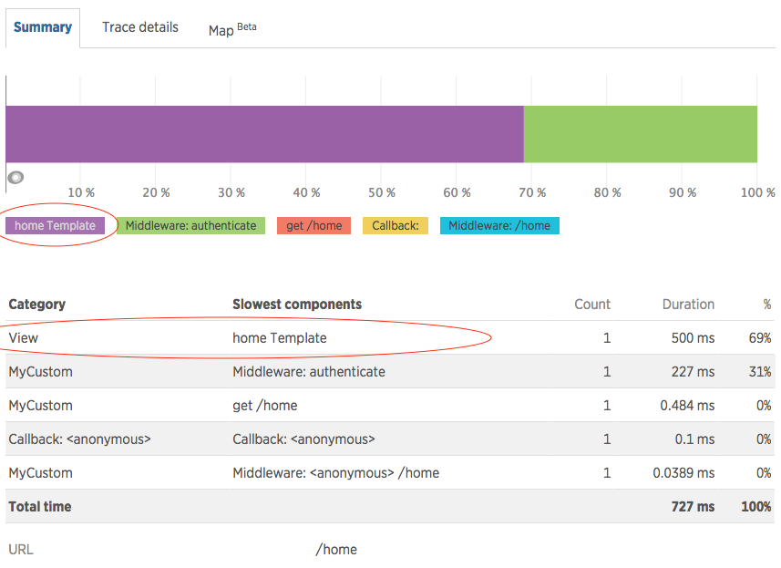

### Pre-requisite

{@tutorial Instrumentation-Basics}

### Introduction

This tutorial goes over basic concepts of using the WebFramework instrumentation API.
In order to demonstrate the topics, we will use a hypothetical web framework that has
similar concepts to popular web frameworks such as Express or Restify.

Here is an example of how the web framework would be used in a user's code:

```js
const myWebFramework = require('my-web-framework')
const authenticate = require('./lib/authenticate')

// create server
let server = new myWebFramework.Server()

server.all(function authenticateMiddleware(req, res, next) {
  if (authenticate()) {
    next()
  } else {
    res.statusCode = 403
    res.end()
  }
})

server.get('/api/users', function(req, res) {
  res.write(getUsers())
  res.end()
})

server.get('/home', function(req, res) {
  this.render('home', function(err, renderedView) {
    res.write(renderedView)
    res.end()
  })
})

server.start(8080)
```

In this example, the web application server is serving two endpoints. Endpoint
`/api/users` returns a list of users as JSON data. The second endpoint `/home` renders
and returns an HTML view. It also has an authentication middleware that is executed for
any type of request.

### The Instrumentation Function

To add instrumentation to a web framework, you supply a single function which is
responsible for telling New Relic which framework methods should be instrumented
and what metrics and data to collect. The agent calls this instrumentation
function automatically when the web framework module is required in the user's
code. The function must be registered with the agent by calling {@link
API#instrumentWebframework}.

```js
const newrelic = require('newrelic')
newrelic.instrumentWebframework('my-web-framework', instrumentMyWebFramework)
```

The instrumentation function can be included in the application code itself or
it can live in a separate instrumentation module. In either case, we need to
register it in our application code in order for the agent to use it.

The instrumentation function has the following signature:

```js
function instrumentMyWebFramework(shim, myModule, moduleName) {
```

It receives a {@link WebFrameworkShim}, the module to instrument and the name of the
package.

For more details, see {@tutorial Instrumentation-Basics}.

### Specifying the Framework

The first thing the instrumentation should do is specify the name of the framework it is
instrumenting. The value is used as a part of metric names and transaction event
attributes. It is also displayed in the Environment view.

```js
  shim.setFramework('MyCustom')
```

[]

### What to Record

Web framework instrumentation will generally be responsible for the following:

* naming the transaction
* recording metrics for middleware functions
* recording metrics for rendering views
* reporting errors that are handled by the web framework

### Transaction Naming

A single transaction represents all activity that is tied to a single HTTP request from
the time it is received until the app server sends a response back. In order to see
meaningful metrics for similar transactions (e.g. ones that hit the same URL endpoint),
the instrumentation needs to determine and assign a name for each transaction.

The Node agent names transactions using the HTTP verb and the request URI. The
verb is automatically determined from the HTTP request. However, the URI must
typically be normalized in order to group related transactions in a meaningful way.
For more details, see [Metric grouping issues](https://docs.newrelic.com/docs/agents/manage-apm-agents/troubleshooting/metric-grouping-issues).

The API provides a basic function for setting the URI to use for naming - {@link WebFrameworkShim#setTransactionUri}.
This would be sufficient for a very basic use case when the URI can be determined in a
single point in the instrumentation code.

However, many common web frameworks route each request through many functions, which may
contribute to the final name. In order to help with the common use case of nested
middlewares, the API provides a mechanism for naming transactions based on paths that
middleware functions are mounted on.

### Middlewares

Many frameworks have a concept of middlewares. Middleware is a function that is executed
in response to a request for a specific URL endpoint. Middleware can either respond to
the HTTP request or pass control to another middleware.

Since there can be many middlewares executed for a single request, it is useful to know
how much time is spent in each middleware when troubleshooting performance.

[]


There are two API functions related to middleware - {@link WebFrameworkShim#recordMiddleware}
and {@link WebFrameworkShim#wrapMiddlewareMounter}. Based on our web app code, we would
expect to record a middleware metric for the authentication middleware, and also for the
endpoint middleware that responds to a specific request. Here is what the instrumenation
would look like:

```js
let Server = myWebFramework.Server

shim.wrapMiddlewareMounter(Server.prototype, ['all', 'get'], {
  route: shim.FIRST,
  wrapper: function wrapMiddleware(shim, fn, name, route) {
    return shim.recordMiddleware(fn, {
      route: route,
      type: shim.MIDDLEWARE,
      req: shim.FIRST,
      res: shim.SECOND,
      next: shim.THIRD
    })
  }
})

```

In order to record the correct middleware metrics, middleware functions should
be wrapped using the {@link WebFrameworkShim#recordMiddleware} API method.

Note that middleware functions may not be exposed directly on the framework.  So
in order to get access to the middleware function so you can call
`recordMiddleware`, you may need to wrap the framework method that is used to
register the middleware.

A common pattern is a function that takes a path and one or more middleware
functions. For example, Express has routing methods such as `get`, `post`,
`put`, and `use`. The Restify framework has a similar pattern. In our example
framework, we use the `get` and `all` methods the same way.

Since this is a common pattern, our API provides method {@link
WebFrameworkShim#wrapMiddlewareMounter} to make it easier to wrap middlewares in
this particular case. In cases where the framework has a different mechanism for
registering middlewares, the instrumentation would need to fallback to basic
wrapping ({@link Shim#wrap}) in order to get to the place where middleware
functions can be intercepted. For an example of instrumentation that does not
use {@link WebFrameworkShim#wrapMiddlewareMounter}, see our built-in Hapi
instrumentation.

Going back to our instrumentation example... We will use the {@link
WebFrameworkShim#wrapMiddlewareMounter} method to wrap `all` and `get`. The
third argument in that call is the spec where we tell the instrumentation which
argument is the route path, and what to do with all other arguments that
represent the middleware functions. The instrumentation will call the `wrapper`
function for each middleware function, and here we need to wrap the original
function and return the wrapped version of it.

This is where {@link WebFrameworkShim#recordMiddleware} comes in. It takes the
original middleware function as the first argument, and a spec describing the
middleware function signature. The `req`, `res`, and `next` parameters tell the
instrumentation which arguments are which. The `route` and `type` arguments are
used for correctly naming the middleware metrics.

The following types are allowed:

| type | description | generated metric | trace segment |
| --- | --- | --- |
| MIDDLEWARE | Represents a generic middleware function. This could be a function that is executed for all types of requests (e.g. authentication), or a responder function associated (mounted) with a specific URL path. | `Nodejs/Middleware/<framework>/<function name>/<mounted path>` | `Middleware: <function name> <mounted path>` <br/><br/>Note: If the middleware is nested under a ROUTE middleware, the path is omitted (since it's displayed in the ROUTE segment name). |
| ERRORWARE | Used for recording middlewares that are used for handling errors. | `Nodejs/Middleware/<framework>/<function name>/<mounted path>`<br/><br/>Note: The mounted path will reflect the path that was current when the error occurred. If the error handler itself is not mounted on a path, its path is appended to the originating path. | `Middleware: <function name> <mounted path>` |
| PARAMWARE | This is a special type of middleware used for extracting parameters from URLs. | `Nodejs/Middleware/<framework>/<function name>//[param handler :<param name>]` | `Middleware: <function name> /[param handler :<param name>]` |
| ROUTE | Used for grouping multiple middleware functions under a single route path. | no metric | `Route Path: <mounted path>` |
| ROUTER | Used to create a trace segment for a router object that is mounted on a path. | no metric | `Router: <mounted path>` |
| APPLICATION | Used for application object that is mounted as a router. This is a concept in Express, and typically will not be used in other framework instrumenations. | no metric | `Mounted App: <mounted path>` |


### Views

Web frameworks will often provide mechanisms for rendering views from templates.
Rendering views can be time consuming, and therefore New Relic can collect and
display a specific metric (`View/<view name>/Rendering`) related to this. In
order to capture these metrics, use the {@link WebFrameworkShim#recordRender}
API method.

Let's assume that the Server object in our custom web framework has a `render`
function that takes the name of the view and a callback. The callback returns
the generated content. In order to record this work as the View metric, we will
do the following in our instrumentation:

```js
let Server = myWebFramework.Server

shim.recordRender(Server.prototype, 'render', {
  view: shim.FIRST,
  callback: shim.LAST
})
```

[]

Note that in some cases (e.g. in Express) the `render` function may be directly
on the `req` object and may be invoked without accepting a callback. In this
case calling the `render` function could be ending the HTTP response itself. In
such a case, in order to capture correct timing for the render function,
additional instrumentation would be needed based on how the web framework is
implemented.

### Errors

Web frameworks will typically capture errors generated from middlewares (either
uncaught or provided by the user, e.g. by calling `next(error)` in Express) and
respond with a HTTP 500 error. If these errors are not handled by the user (e.g.
using an errorware function), then it is more useful to report the original
errors instead of a generic HTTP 500). The API provides the {@link
WebFrameworkShim#noticeError} method for reporting errors to New Relic.

Let's assume that our web framework emits an event everytime an error occurs. We
can listen on this event, and call {@link WebFrameworkShim#noticeError}.

```js
server.on('error', function(req, error) {
  shim.noticeError(req, error)
})
```

Now let's assume that at a later point, the web framework calls a middleware
where the user handles the error themselves. In this case, the error should no
longer be reported. We can use the {@link WebFrameworkShim#errorHandled}
function to remove the error:

```js
shim.errorHandled(req, error)
```


### Questions?

We have an extensive [help site](https://support.newrelic.com/) as well as
[documentation](https://docs.newrelic.com/). If you can't find your answers
there, please drop us a line on the [community forum](https://discuss.newrelic.com/).
