# Class Inheritance Graph for lib/subscribers/

## Mermaid Diagram

```mermaid
graph TD
    %% Root Classes
    Subscriber[Subscriber<br/>base.js]
    DcBase[Subscriber<br/>dc-base.js]
    MetaSubscriber[MetaSubscriber]
    MiddlewareWrapper[MiddlewareWrapper<br/>helper class]

    %% First Level - Direct children of Subscriber (base.js)
    Subscriber --> DbSubscriber
    Subscriber --> MessageConsumerSubscriber
    Subscriber --> MessageProducerSubscriber
    Subscriber --> MiddlewareSubscriber
    Subscriber --> PropagationSubscriber
    Subscriber --> ApplicationLogsSubscriber
    Subscriber --> GoogleGenAISubscriber
    Subscriber --> OpenAISubscriber
    Subscriber --> McpClientRequestSubscriber
    Subscriber --> PgConnectSubscriber
    Subscriber --> GetMessageSubscriber
    Subscriber --> ConnectSubscriber
    Subscriber --> PurgeQueueSubscriber
    Subscriber --> MySQLPoolQuerySubscriber

    %% Second Level - DbSubscriber children
    DbSubscriber --> DbOperationSubscriber
    DbSubscriber --> DbQuerySubscriber

    %% Third Level - DbOperationSubscriber children
    DbOperationSubscriber --> CassandraConnectSubscriber
    DbOperationSubscriber --> CassandraShutdownSubscriber
    DbOperationSubscriber --> IoRedisSubscriber

    %% Third Level - DbQuerySubscriber children
    DbQuerySubscriber --> CassandraBatchSubscriber
    DbQuerySubscriber --> CassandraEachRowSubscriber
    DbQuerySubscriber --> CassandraExecuteSubscriber
    DbQuerySubscriber --> ElasticSearchSubscriber
    DbQuerySubscriber --> MySQLConnectionQuerySubscriber
    DbQuerySubscriber --> PgQuerySubscriber

    %% Fourth Level - Cassandra Legacy
    CassandraConnectSubscriber --> LegacyCassandraConnectSubscriber
    CassandraShutdownSubscriber --> LegacyCassandraShutdownSubscriber
    CassandraBatchSubscriber --> LegacyCassandraBatchSubscriber
    CassandraEachRowSubscriber --> LegacyCassandraEachRowSubscriber
    CassandraExecuteSubscriber --> LegacyCassandraExecuteSubscriber

    %% Fourth Level - ElasticSearch
    ElasticSearchSubscriber --> OpenSearchSubscriber
    ElasticSearchSubscriber --> ElasticSearchTransportSubscriber

    %% Fourth Level - MySQL
    MySQLConnectionQuerySubscriber --> MySQL2ConnectionQuerySubscriber
    MySQL2ConnectionQuerySubscriber --> MySQL2ConnectionExecuteSubscriber

    %% Fourth Level - Postgres
    PgQuerySubscriber --> PgNativeQuerySubscriber

    %% Fourth Level - MySQL Pool Query
    MySQLPoolQuerySubscriber --> MySQLPoolNamespaceQuerySubscriber
    MySQLPoolQuerySubscriber --> MySQL2PoolQuerySubscriber

    MySQLPoolNamespaceQuerySubscriber --> MySQL2PoolNamespaceQuerySubscriber

    %% Second Level - MiddlewareSubscriber children
    MiddlewareSubscriber --> ExpressSubscriber
    MiddlewareSubscriber --> FastifyDecorateSubscriber
    MiddlewareSubscriber --> FastifyAddHookSubscriber

    %% Third Level - Express hierarchy
    ExpressSubscriber --> ExpressRouteSubscriber
    ExpressSubscriber --> ExpressParamSubscriber
    ExpressSubscriber --> ExpressUseSubscriber
    ExpressSubscriber --> ExpressRenderSubscriber

    ExpressRouteSubscriber --> ExpressRouterRouteSubscriber
    ExpressParamSubscriber --> ExpressRouterParamSubscriber
    ExpressUseSubscriber --> ExpressRouterUseSubscriber

    %% Second Level - ApplicationLogsSubscriber children
    ApplicationLogsSubscriber --> BunyanBaseSubscriber
    ApplicationLogsSubscriber --> PinoSubscriber

    %% Third Level - Bunyan
    BunyanBaseSubscriber --> BunyanEmitSubscriber
    BunyanBaseSubscriber --> BunyanLoggerSubscriber

    %% Second Level - MessageConsumerSubscriber children
    MessageConsumerSubscriber --> ConsumeSubscriber

    %% Second Level - MessageProducerSubscriber children
    MessageProducerSubscriber --> ChannelSubscriber

    %% Second Level - PropagationSubscriber children
    PropagationSubscriber --> MySQLPoolGetConnectionSubscriber
    PropagationSubscriber --> AcceptMessageSubscriber
    PropagationSubscriber --> SendOrEnqueueSubscriber

    %% Third Level - MySQL2 Pool Get Connection
    MySQLPoolGetConnectionSubscriber --> MySQL2PoolGetConnectionSubscriber

    %% Second Level - GetMessageSubscriber children
    GetMessageSubscriber --> GetMessageCbSubscriber

    %% Second Level - PurgeQueueSubscriber children
    PurgeQueueSubscriber --> PurgeQueueCbSubscriber

    %% Second Level - GoogleGenAISubscriber children
    GoogleGenAISubscriber --> GoogleGenAIGenerateContentSubscriber
    GoogleGenAISubscriber --> GoogleGenAIEmbedContentSubscriber

    %% Third Level - Google GenAI
    GoogleGenAIGenerateContentSubscriber --> GoogleGenAIGenerateContentStreamSubscriber

    %% Second Level - OpenAISubscriber children
    OpenAISubscriber --> OpenAIChatCompletions
    OpenAISubscriber --> OpenAIEmbeddings
    OpenAISubscriber --> OpenAIClientSubscriber

    %% Third Level - OpenAI
    OpenAIChatCompletions --> OpenAIResponses

    %% DC Base hierarchy (separate from main Subscriber)
    DcBase --> FastifyInitialization
    DcBase --> UndiciSubscriber

    %% MetaSubscriber children
    MetaSubscriber --> ChannelModelSubscriber
    MetaSubscriber --> CallbackModelSubscriber

    %% Styling
    classDef baseClass fill:#e1f5ff,stroke:#01579b,stroke-width:3px
    classDef secondLevel fill:#fff3e0,stroke:#e65100,stroke-width:2px
    classDef thirdLevel fill:#f3e5f5,stroke:#4a148c,stroke-width:2px
    classDef helper fill:#e8f5e9,stroke:#1b5e20,stroke-width:2px

    class Subscriber,DcBase,MetaSubscriber baseClass
    class DbSubscriber,MessageConsumerSubscriber,MessageProducerSubscriber,MiddlewareSubscriber,PropagationSubscriber,ApplicationLogsSubscriber secondLevel
    class DbOperationSubscriber,DbQuerySubscriber thirdLevel
    class MiddlewareWrapper helper
```



## Hierarchy Summary

### Main Inheritance Tree (from `Subscriber` in base.js)

#### 1. Database Hierarchy
```
Subscriber
└── DbSubscriber
    ├── DbOperationSubscriber
    │   ├── CassandraConnectSubscriber
    │   │   └── LegacyCassandraConnectSubscriber
    │   ├── CassandraShutdownSubscriber
    │   │   └── LegacyCassandraShutdownSubscriber
    │   └── IoRedisSubscriber
    │
    └── DbQuerySubscriber
        ├── CassandraBatchSubscriber
        │   └── LegacyCassandraBatchSubscriber
        ├── CassandraEachRowSubscriber
        │   └── LegacyCassandraEachRowSubscriber
        ├── CassandraExecuteSubscriber
        │   └── LegacyCassandraExecuteSubscriber
        ├── ElasticSearchSubscriber
        │   ├── OpenSearchSubscriber
        │   └── ElasticSearchTransportSubscriber
        ├── MySQLConnectionQuerySubscriber
        │   └── MySQL2ConnectionQuerySubscriber
        │       └── MySQL2ConnectionExecuteSubscriber
        └── PgQuerySubscriber
            └── PgNativeQuerySubscriber
```

#### 2. Middleware Hierarchy
```
Subscriber
└── MiddlewareSubscriber
    ├── ExpressSubscriber
    │   ├── ExpressRouteSubscriber
    │   │   └── ExpressRouterRouteSubscriber
    │   ├── ExpressParamSubscriber
    │   │   └── ExpressRouterParamSubscriber
    │   ├── ExpressUseSubscriber
    │   │   └── ExpressRouterUseSubscriber
    │   └── ExpressRenderSubscriber
    │
    ├── FastifyDecorateSubscriber
    └── FastifyAddHookSubscriber
```

#### 3. Logging Hierarchy
```
Subscriber
└── ApplicationLogsSubscriber
    ├── BunyanBaseSubscriber
    │   ├── BunyanEmitSubscriber
    │   └── BunyanLoggerSubscriber
    └── PinoSubscriber
```

#### 4. Messaging Hierarchy
```
Subscriber
├── MessageConsumerSubscriber
│   └── ConsumeSubscriber
│
└── MessageProducerSubscriber
    └── ChannelSubscriber
```

#### 5. Context Propagation Hierarchy
```
Subscriber
└── PropagationSubscriber
    ├── MySQLPoolGetConnectionSubscriber
    │   └── MySQL2PoolGetConnectionSubscriber
    ├── AcceptMessageSubscriber
    └── SendOrEnqueueSubscriber
```

#### 6. AI/ML Hierarchy
```
Subscriber
├── GoogleGenAISubscriber
│   ├── GoogleGenAIGenerateContentSubscriber
│   │   └── GoogleGenAIGenerateContentStreamSubscriber
│   └── GoogleGenAIEmbedContentSubscriber
│
└── OpenAISubscriber
    ├── OpenAIChatCompletions
    │   └── OpenAIResponses
    ├── OpenAIEmbeddings
    └── OpenAIClientSubscriber
```

#### 7. Standalone Direct Descendants
```
Subscriber
├── McpClientRequestSubscriber
├── PgConnectSubscriber
│   └── PgNativeConnectSubscriber
├── GetMessageSubscriber
│   └── GetMessageCbSubscriber
├── ConnectSubscriber
├── PurgeQueueSubscriber
│   └── PurgeQueueCbSubscriber
└── MySQLPoolQuerySubscriber
    ├── MySQLPoolNamespaceQuerySubscriber
    │   └── MySQL2PoolNamespaceQuerySubscriber
    └── MySQL2PoolQuerySubscriber
```

### Separate Inheritance Tree (from `Subscriber` in dc-base.js)

```
Subscriber (dc-base.js)
├── FastifyInitialization
└── UndiciSubscriber
```

### MetaSubscriber Tree

```
MetaSubscriber
├── ChannelModelSubscriber
└── CallbackModelSubscriber
```

### Helper Classes (Not Subscribers)

- **MiddlewareWrapper**: A helper class used by MiddlewareSubscriber to wrap middleware functions

## Statistics

- **Total Root Classes**: 3 (Subscriber from base.js, Subscriber from dc-base.js, MetaSubscriber)
- **Total Subscriber Classes**: 75+
- **Maximum Inheritance Depth**: 6 levels (e.g., Subscriber → MySQLPoolQuerySubscriber → MySQLPoolNamespaceQuerySubscriber → MySQL2PoolNamespaceQuerySubscriber)
- **Main Categories**: 7 (Database, Middleware, Logging, Messaging, Propagation, AI/ML, Standalone)

## Key Patterns

1. **Database Pattern**: Most database subscribers extend either `DbOperationSubscriber` (for operations like connect/shutdown) or `DbQuerySubscriber` (for actual queries)

2. **Legacy Pattern**: Cassandra has legacy versions that extend the modern implementations

3. **Framework Pattern**: Express and Fastify have specialized middleware subscribers

4. **Database Compatibility**: MySQL2 extends MySQL subscribers to maintain compatibility

5. **Dual Base**: Two different `Subscriber` base classes serve different purposes:
   - `base.js`: For tracing channel-based instrumentation
   - `dc-base.js`: For direct diagnostic channel subscriptions
